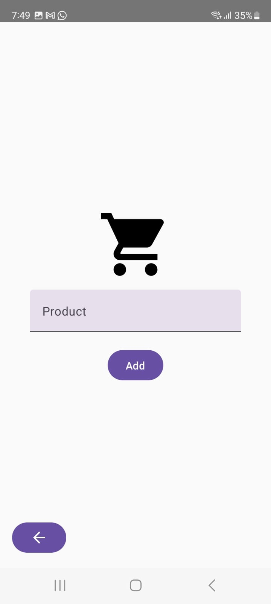

# Lista de Compras Android App

Este proyecto es una aplicación Android desarrollada para gestionar una lista de compras. Utiliza principios de programación asincrónica con corrutinas, una base de datos SQLite para persistencia y Room como librería para acceder a la base de datos. Además, se implementa una interfaz multilenguaje utilizando Jetpack Compose.

## Requisitos del Proyecto

1. **Pantalla Principal**: La aplicación debe mostrar una lista de elementos de la lista de compras. Cada elemento debe tener un nombre y un ícono para marcarlo como comprado o no.
   
2. **Agregar Elementos**: La aplicación debe permitir agregar elementos a la lista de compras. Al agregar un nuevo elemento, se debe almacenar en la base de datos SQLite y aparecer en la lista.
   
3. **Eliminar Elementos**: La aplicación debe permitir eliminar un elemento de la lista de compras.
   
4. **Marcar como Comprado**: Los usuarios deben poder marcar un ítem como comprado, cambiando el ícono en la lista.

5. **Persistencia de Datos**: La aplicación utiliza SQLite y Room para almacenar la lista de compras.
   
6. **Multilenguaje**: Los textos de los botones y las etiquetas deben ser soportados tanto en español como en inglés.

## Características Implementadas

- **Lista de Compras**: Muestra todos los productos y permite interactuar con ellos.
- **Agregar Producto**: Permite agregar nuevos productos con su descripción.
- **Eliminar Producto**: Permite eliminar productos de la lista.
- **Marcar como Comprado**: Los productos pueden ser marcados como comprados.

## Requisitos Técnicos

- **Fundamentos de Programación Asincrónica**: La app hace uso de corutinas de Kotlin para la programación asincrónica, permitiendo manejar operaciones de base de datos sin bloquear el hilo principal.
  
- **Fundamentos de Bases de Datos SQLite y Room**: Se utiliza SQLite para almacenar los productos de la lista de compras y Room como una capa de abstracción sobre SQLite.

- **Jetpack Compose**: La interfaz de usuario se desarrolla utilizando Jetpack Compose, que es un enfoque moderno para construir UI en Android.

## Instrucciones para Ejecutar el Proyecto

### 1. Clonar el Proyecto

Si aún no has clonado el proyecto, puedes hacerlo usando el siguiente comando:

```bash
git clone https://github.com/Yistler/ListaCompras.git
cd ListaCompras
```

### 2. Abrir el Proyecto en Android Studio
Abre Android Studio.
Selecciona Open an Existing Project.
Navega hasta el directorio donde clonaste el repositorio y selecciona la carpeta del proyecto.

### 3. Configuración de Dependencias
Si es la primera vez que abres el proyecto, Android Studio puede pedirte que sincronices las dependencias. Haz clic en Sync Now en la barra superior para descargar las dependencias necesarias.

### 4. Ejecutar la Aplicación
Para ejecutar la aplicación, selecciona un emulador o conecta un dispositivo físico y presiona el botón de Run (el ícono de "Play" verde en la esquina superior).

## Capturas de Pantalla

### Pantalla Principal:


### Agregar Producto:


### Lista de productos agregados


## Tecnologías Usadas
Kotlin<br>
Jetpack Compose<br>
Room (Para persistencia de datos)<br>
SQLite (Base de datos local)<br>
Coroutines (Para operaciones asincrónicas)
